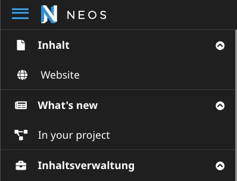
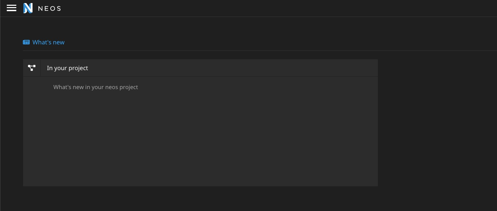
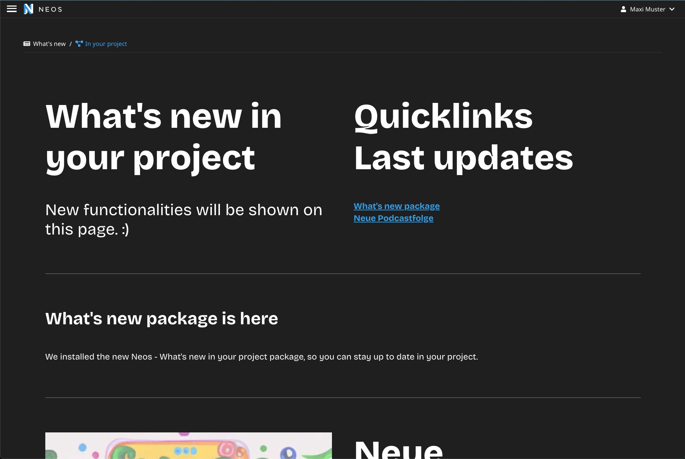
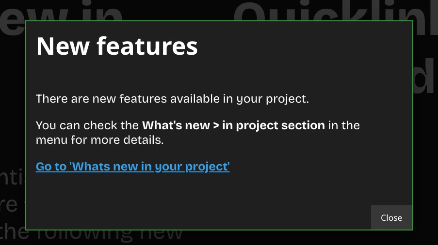

# Neos.WhatsNewDashboard


The WhatsNewDashboard is a backend module that adds different news-pages to Neos CMS.
Target audience are editors that work with Neos but do not have a technical background.

The first implemented use case is a news stream about the website they are currently editing. The dev team will be able to maintain a neos document that communicates via text and images what has changed within the project, e.g. new fields in the inspector. 
To do this, you will need to install a second package: [Neos.WhatsNewEditor.InMyProject](https://github.com/Flowpack/Flowpack.Neos.WhatsNewEditor.InMyProject) that contains nodetypes for said news page, its content and css styles.

Further use cases could be an editor-centered changelog (what has changed in the UI between my last neos version to the current one?) or announcements about new Neos Versions by the Neos Core team.

## Compatibility

This package supports Neos 8 and Neos 9 from the same branch. When using the
[Neos.WhatsNewEditor.InMyProject](https://github.com/Flowpack/Flowpack.Neos.WhatsNewEditor.InMyProject)
companion package, its major version must match your Neos version:

| Neos | flowpack/neos-whatsnewdashboard | flowpack/neos-whatsneweditor-inmyproject |
|------|---------------------------------|------------------------------------------|
| 8.x  | ^1.0                            | ^1.0                                     |
| 9.x  | ^1.0                            | ^2.0.1 (2.0.0 does not work on Neos 9: the info dialog never triggers) |

## Integration

### Installation

Install via composer with `composer require flowpack/neos-whatsnewdashboard`.

### Usage

We assume you have installed the [Neos.WhatsNewEditor.InMyProject](https://github.com/Flowpack/Flowpack.Neos.WhatsNewEditor.InMyProject) package in your neos instance and you have created a news page with this package. To show those news for your project add the `inProjectSourceUrl` to your `Settings.yaml` like this:

```yaml
Flowpack:
  Neos:
    WhatsNewDashboard:
      inProjectSourceUrl: 'https://my-page.de/whats-new' # example url
```

The url may simply point to a (news) page of the same Neos instance.

HINT: For now it is not possible to show news which are created in another Neos instance with another domain, but we plan to make this possible.

## Backend Module

After installing this package you get a new entry in the menu:



On the `What's new page` you have a tile for the `In your project` news.



You can see the news page you configured in the `Settings.yaml` on the `In your project` page.



## Info dialog

When you updated your news page all backend users get an info dialog which notifies them that new news are available.

The dialog is triggered by the news page's `Client notification date time` property: set or update it
in the inspector and publish the page to notify users — content changes alone do not trigger it.
Dismissal is stored per user/browser in a cookie (`whatsNewNoteClosedTimestamp`), so the dialog shows
once per notification date (and currently also on a user's very first backend visit).



## Development & Testing

The repository ships an end-to-end test suite in [`Tests/E2E/`](./Tests/E2E/README.md): dockerized
Neos 8 and Neos 9 systems under test running this package (and the companion package in its matching
version), driven by Playwright/BDD feature files. Run `make setup` once, then `make test` — or see
the [E2E README](./Tests/E2E/README.md) for per-variant targets and the local dev loop. The same
suite runs in CI for every push and pull request (see badge above).

