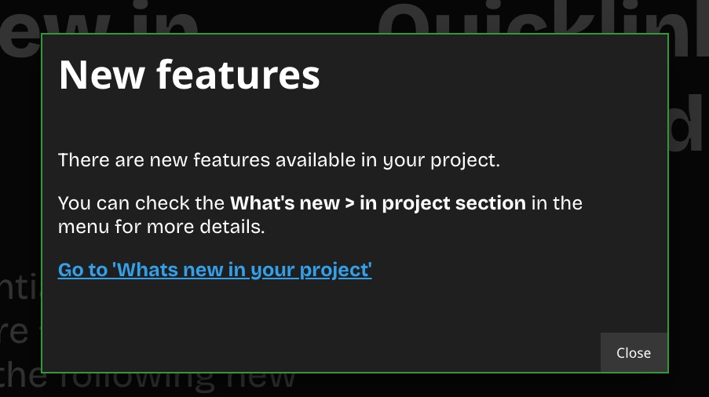

# Neos.WhatsNewDashboard
The WhatsNewDashboard is a backend module that adds different news-pages to Neos CMS.
Target audience are editors that work with Neos but do not have a technical background.

The first implemented use case is a news stream about the website they are currently editing. The dev team will be able to maintain a neos document that communicates via text and images what has changed within the project, e.g. new fields in the inspector. 
To do this, you will need to install a second package: [Neos.WhatsNewEditor.InMyProject](https://github.com/Flowpack/Flowpack.Neos.WhatsNewEditor.InMyProject) that contains nodetypes for said news page, its content and css styles.

Further use cases could be an editor-centered changelog (what has changed in the UI between my last neos version to the current one?) or announcements about new Neos Versions by the Neos Core team.

## Integration

### Installation

Install via composer with `composer require flowpack/neos-whatsnewdashboard`.

### Usage

We assume you have installed the [Neos.WhatsNewEditor.InMyProject](https://github.com/Flowpack/Flowpack.Neos.WhatsNewEditor.InMyProject) package in your neos instance and you have created a news page with this package. To show those news for your project add the `inProjectSourceUrl` to your `Settings.yaml` like this:

```yaml
Flowpack:
  Neos:
    WhatsNewDashboard:
      inProjectSourceUrl: 'https://my-page.de/whats-new' # example url
```

HINT: For now it is not possible to show news which are created in another neos instance with another domain, but be plan to make this possible.

## Backend Module

After installing this package you get a new entry in the menu:


On the `What's new page` you have a tile for the `In your project` news.


You can see the news page you configured in the `Settings.yaml` on the `In your project` page.


## Info dialog

When you updated your news page all backend users get an info dialog which notifies them that new news are available.



